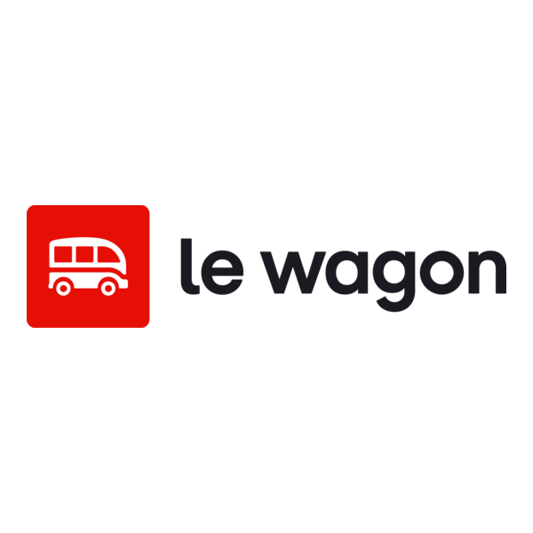
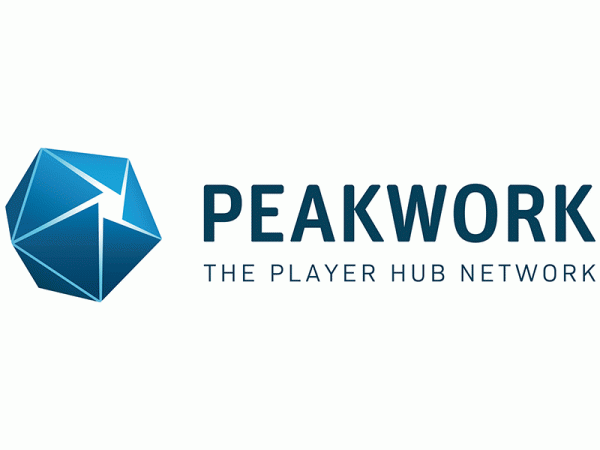

<h1 align="center">Hi, I'm Syeda Tabassum Rahaman</h1>

  Data Analytics → Machine Learning → Practical GenAI | Germany 🇩🇪

  
  

## 📫 Contact
- LinkedIn: https://www.linkedin.com/in/syeda-tabassum-rahaman/
- Email: syeda.tabassum.work@gmail.com

---

## 🎯 Profile
Former **Software QA Lead** (automation + data validation) transitioning into **Data / ML**.
I build end-to-end projects with clean pipelines, strong evaluation, and explainability.

---

## 🧰 Skill Sets

### 🧮 Data & Analysis

### 🤖 Machine Learning

Classification · Regression · Feature Engineering · Model Evaluation

### 🧠 GenAI (Hands-on)

LLM Fundamentals · RAG Workflows

### ⚙️ MLOps & Backend

### 📊 Visualization & Tools

---

## ⭐ Featured Projects

### 🔍 AI-Driven Scam Job Detection (NLP & Explainability)
- Developed a machine learning system to identify fraudulent job postings, prioritizing model transparency and trust.
- Key Achievement: Integrated SHAP (Explainable AI) to visualize why the model flags a specific post as a scam, addressing the "Black Box" problem in AI.
- Tech Stack: Python, Scikit-Learn, NLP (TF-IDF), SHAP, Streamlit.
- Focus: Model interpretability, security-centric data pipelines, and practical UI output.
🔗 Repo: https://github.com/syeda-tabassum-rahaman/scam-job-detector
streamlit: https://scamjobdetector.streamlit.app/

### 🩺 Healthcare Premium Prediction 
*A predictive analytics pipeline designed to automate healthcare premium estimations and support actuarial risk assessment.*

* **Key Achievement:** Achieved **98.5% prediction accuracy** using a hybrid regression approach (XGBoost), incorporating a custom validation layer to ensure data integrity.
* **Tech Stack:** Python, XGBoost, Scikit-Learn, Joblib, Streamlit.
* **Focus:** Actuarial risk modeling, automated data validation, and real-time inference for financial services. 
🔗 Repo: (https://github.com/syeda-tabassum-rahaman/healthcare-premium-prediction-ml)
Streamlit: https://healthcare-premium-insurance-price-prediction-v2.streamlit.app/

### 🏨 Hospitality Revenue & Performance Analysis
*A Business Intelligence (BI) solution focused on optimizing revenue streams and booking efficiency for the international travel-tech sector.*

* **Key Achievement:** Automated the tracking of industry-standard hospitality KPIs (**RevPAR, ADR, Occupancy %**) to identify revenue leakage and platform-specific performance trends.
* **Tech Stack:** Python, Pandas, Matplotlib, Seaborn.
* **Focus:** Revenue management, data cleaning for high-volume booking systems, and market-specific trend analysis. 
🔗 Repo: (https://github.com/syeda-tabassum-rahaman/hospitality-revenue-performance-analysis)
---

## 💼 Experience

### 🎓  Le Wagon

**Le Wagon** · Data Science & AI Bootcamp  
📅 Oct 2025 – Dec 2025  

- Completed an intensive, project-based bootcamp focused on **Data Science, Machine Learning, and AI**.
- Built end-to-end projects using **Python, Pandas, NumPy, scikit-learn, Jupyter Notebook**.
- Worked on **Exploratory Data Analysis (EDA)**, supervised ML models, and evaluation pipelines.
- Hands-on exposure to **LLMs, RAG workflows, LangChain basics**, and ML deployment concepts.
- Followed industry-style workflows with **Git, GitHub, documentation, and reproducibility**.

---

### 🏢  Peakwork GmbH

**Peakwork** · Software QA Lead/ Senior QA Engineer
**Oct 2022 – Feb 2025 | Düsseldorf, Germany**

- Led quality assurance for large-scale **travel data platforms** (pricing, search, booking flows)
- Validated complex **API-driven datasets**, focusing on data accuracy and consistency
- Built and expanded **automation frameworks** (Cypress, Selenium) to improve data reliability
- Collaborated with backend engineers on **root-cause analysis** and defect prevention
- Introduced structured **data validation & QA processes** and mentored junior testers

---

