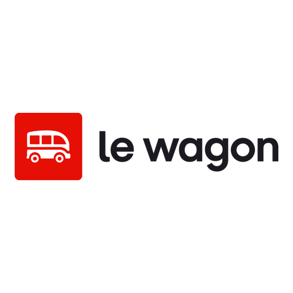
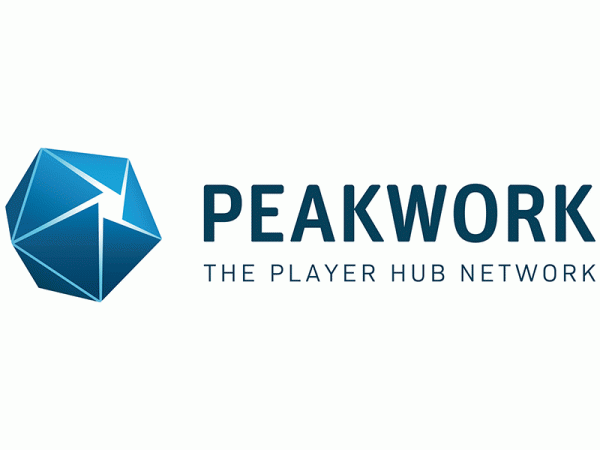

<h1 align="center">Hi, I'm Syeda Tabassum Rahaman</h1>

  Applied Machine Learning Engineer | Data Science & GenAI (RAG, Explainability) | Germany 🇩🇪

  
  

## 📫 Contact
- LinkedIn: https://www.linkedin.com/in/syeda-tabassum-rahaman/
- Email: syeda.tabassum.work@gmail.com

---

## 🎯 Profile
Former **Software QA Lead** (automation + data validation) now working in **Applied Machine Learning, Data Science, and GenAI.**.
I build end-to-end projects with clean pipelines, strong evaluation, and explainability.

* 🎓 **M.Sc. in Information Engineering and CS** | Rhine-Waal University of Applied Sciences, Germany.
* 🗣️ **Languages:** English (Fluent, C1) | German (telc B2 Level).

---

## 🧰 Skill Sets

| Category | Skills & Tools |
|---------|----------------|
| 🧮 **Data & Analysis** | Python · Pandas · NumPy · SQL · Jupyter Notebook |
| 🤖 **Machine Learning** | scikit-learn · Classification · Regression · Feature Engineering · Model Evaluation  |
| 🧠 **GenAI (Hands-on)** | LangChain · Hugging Face · LLM Fundamentals · RAG Workflows · XGboost · SHAP(Explainalbe AI) |
| ⚙️ **MLOps & Backend** | Docker · FastAPI · MLflow · Google Cloud Platform (GCP) |
| 📊 **Visualization & Tools** | Power BI · Git · GitHub · VS Code |

---

## ⭐ Featured Projects

### 🔍 AI-Driven Scam Job Detection (NLP & Explainability)
- Developed a machine learning system to identify fraudulent job postings, prioritizing model transparency and trust.
- Key Achievement: Integrated SHAP (Explainable AI) to visualize why the model flags a specific post as a scam, addressing the "Black Box" problem in AI.
- Tech Stack: Python, Scikit-Learn, NLP (TF-IDF), SHAP, Streamlit.
- Focus: Model interpretability, security-centric data pipelines, and practical UI output.
🔗 Repo: https://github.com/syeda-tabassum-rahaman/scam-job-detector
streamlit: https://scamjobdetector.streamlit.app/

### 🩺 Healthcare Insurance Premium cost Prediction 
*A predictive analytics pipeline designed to automate healthcare premium estimations and support actuarial risk assessment.*

* **Key Achievement:** Achieved **98.5% prediction accuracy** using a hybrid regression approach (XGBoost), incorporating a custom validation layer to ensure data integrity.
* **Tech Stack:** Python, XGBoost, Scikit-Learn, Joblib, Streamlit.
* **Focus:** Actuarial risk modeling, automated data validation, and real-time inference for financial services. 
🔗 Repo: (https://github.com/syeda-tabassum-rahaman/healthcare-premium-prediction-ml)
Streamlit: https://healthcare-premium-insurance-price-prediction-v2.streamlit.app/

### 🏠 LLM-Powered Real Estate RAG Assistant (Gen AI)
*A retrieval-augmented AI assistant designed to extract verified insights from real-estate news and market articles.*

* **Key Achievement:** Built an end-to-end **Retrieval-Augmented Generation (RAG)** pipeline that answers user queries **strictly from ingested URLs** and returns **explicit source citations**, minimizing LLM hallucinations.
* **Tech Stack:** Python, LangChain (RAG), ChromaDB, HuggingFace Embeddings (Alibaba-NLP/gte-base-en-v1.5), Groq (LLaMA 3.3), Streamlit.
* **Focus:** Information retrieval, semantic search, explainable LLM outputs, and production-ready AI application design.
* * **Links:** [GitHub Repository](https://github.com/syeda-tabassum-rahaman/llm-real-estate-assistant-streamlit)

### 📊 AtliQ Hardware: Business Insights 360 (Enterprise BI)
*An enterprise-grade Power BI analytics solution designed to transition a global hardware company from static Excel reports to automated, data-driven decision-making.*

* **Key Achievement:** Processed over 1.8 million transaction records to build a dynamic, cross-functional dashboard (Finance, Sales, Supply Chain, Executive), automating financial tracking and mitigating inventory risks (Excess/Out-of-Stock).
* **Tech Stack:** Microsoft Power BI, DAX, Power Query, MySQL, Data Modeling (Snowflake Schema)
* **Focus:** Enterprise business intelligence, dynamic benchmarking, ETL performance optimization, and stakeholder-specific UI/UX design
* **Links:** [GitHub Repository](https://github.com/syeda-tabassum-rahaman/Business_Insights_360_Analytics_Atliq_Hardware) | [Live Power BI Dashboard](https://app.powerbi.com/view?r=eyJrIjoiYjc0ZDVhM2YtOGEwNS00MDZmLWEwMTAtZDQ0MmRmYmY5MDkxIiwidCI6ImM2ZTU0OWIzLTVmNDUtNDAzMi1hYWU5LWQ0MjQ0ZGM1YjJjNCJ9)

### 🏨 Hospitality Revenue & Performance Analysis
*A Business Intelligence (BI) solution focused on optimizing revenue streams and booking efficiency for the international travel-tech sector.*

* **Key Achievement:** Automated the tracking of industry-standard hospitality KPIs (**RevPAR, ADR, Occupancy %**) to identify revenue leakage and platform-specific performance trends.
* **Tech Stack:** Python, Pandas, Matplotlib, Seaborn.
* **Focus:** Revenue management, data cleaning for high-volume booking systems, and market-specific trend analysis. 
🔗 Repo: (https://github.com/syeda-tabassum-rahaman/hospitality-revenue-performance-analysis)

---

## 💼 Experience

### 🎓  Le Wagon

**Le Wagon** · Data Science & AI Bootcamp  
📅 Oct 2025 – Dec 2025  

- Completed an intensive, project-based bootcamp focused on **Data Science, Machine Learning, and AI**.
- Built end-to-end projects using **Python, Pandas, NumPy, scikit-learn, Jupyter Notebook**.
- Worked on **Exploratory Data Analysis (EDA)**, supervised ML models, and evaluation pipelines.
- Hands-on exposure to **LLMs, RAG workflows, LangChain basics**, and ML deployment concepts.
- Followed industry-style workflows with **Git, GitHub, documentation, and reproducibility**.

---

### 🏢  Peakwork GmbH

**Peakwork** · Software QA Lead/ Senior QA Engineer
**Oct 2022 – Feb 2025 | Düsseldorf, Germany**

- Led quality assurance for large-scale **travel data platforms** (pricing, search, booking flows)
- Validated complex **API-driven datasets**, focusing on data accuracy and consistency
- Built and expanded **automation frameworks** (Cypress, Selenium) to improve data reliability
- Collaborated with backend engineers on **root-cause analysis** and defect prevention
- Introduced structured **data validation & QA processes** and mentored junior testers

---

